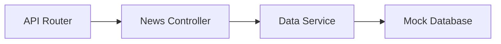
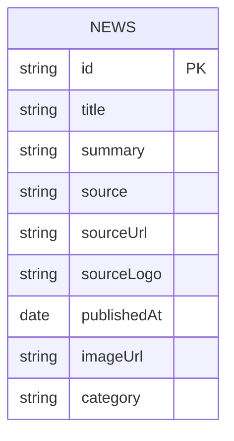

## 1. Architecture Design
使用React + Express + TypeScript全栈架构，后端提供新闻数据API，前端展示新闻内容。

```mermaid
graph TB
    subgraph Frontend
        A[React SPA]
        A1[新闻列表页]
        A2[新闻详情页]
        A --&gt; A1
        A --&gt; A2
    end
    
    subgraph Backend
        B[Express Server]
        B1[新闻API]
        B --&gt; B1
    end
    
    subgraph Data
        C[模拟数据库]
        C1[新闻数据]
        C --&gt; C1
    end
    
    A1 --&gt; B1
    A2 --&gt; B1
    B1 --&gt; C1
```

## 2. Technology Description
- **Frontend**: React@18 + TypeScript + Tailwind CSS + Vite + React Router
- **Backend**: Express@4 + TypeScript
- **Initialization Tool**: vite-init
- **Database**: 内存模拟数据库（演示用），实际项目可替换为PostgreSQL或MongoDB
- **Icons**: lucide-react

## 3. Route Definitions
| Route | Purpose |
|-------|---------|
| / | 首页/新闻列表页 |
| /news/:id | 新闻详情页 |
| /api/news | 获取新闻列表API |
| /api/news/:id | 获取单条新闻详情API |

## 4. API Definitions

### 4.1 Type Definitions
```typescript
interface News {
  id: string;
  title: string;
  summary: string;
  source: string;
  sourceUrl: string;
  sourceLogo: string;
  publishedAt: Date;
  imageUrl: string;
  category: string;
}

interface NewsListResponse {
  success: boolean;
  data: News[];
  total: number;
}

interface NewsDetailResponse {
  success: boolean;
  data: News | null;
}
```

### 4.2 API Endpoints
#### GET /api/news
获取新闻列表
- Query Parameters: `source?` (可选，按媒体筛选)
- Response: `NewsListResponse`

#### GET /api/news/:id
获取单条新闻详情
- Path Parameters: `id`
- Response: `NewsDetailResponse`

## 5. Server Architecture Diagram
后端采用模块化设计，分离路由、控制器和数据层。



## 6. Data Model

### 6.1 Data Model Definition



### 6.2 Mock Data Structure
使用内存数据存储新闻信息，包含主流媒体（如新华社、人民日报、央视新闻、澎湃新闻等）的新闻数据。
