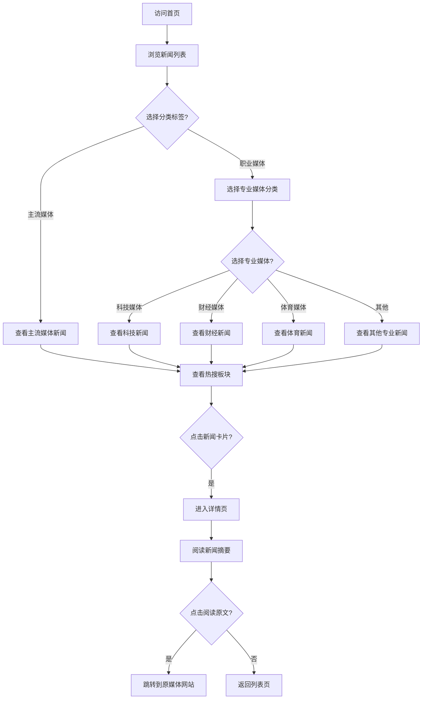

## 1. Product Overview
实时新闻聚合平台，展示主流媒体和专业媒体最新新闻内容，提供新闻摘要和原文跳转功能，聚合各平台热搜。
- 为用户提供一站式实时新闻浏览体验，聚合主流媒体和专业媒体内容，支持原文链接跳转
- 聚合各大社交平台热搜内容，提供一站式热点资讯
- 打造类似App Store iOS 18风格的简洁、现代、美观的用户界面

## 2. Core Features

### 2.1 User Roles
| Role | Registration Method | Core Permissions |
|------|---------------------|------------------|
| Normal User | No registration needed | Browse news list, view news details, jump to original news, view hot searches |

### 2.2 Feature Module
1. **新闻列表页**: 顶部导航、分类标签页、媒体筛选、新闻卡片列表、热搜板块
2. **新闻详情页**: 新闻标题、来源信息、发布时间、新闻摘要、原文链接
3. **热搜板块**: 聚合抖音、哔哩哔哩、微博、小红书等平台热搜

### 2.3 Page Details
| Page Name | Module Name | Feature description |
|-----------|-------------|---------------------|
| 新闻列表页 | 顶部导航 | 显示网站logo、标题，固定在页面顶部 |
| 新闻列表页 | 分类标签页 | 主流媒体、职业媒体两大分类，默认显示主流媒体 |
| 新闻列表页 | 媒体筛选 | 在职业媒体下进一步筛选科技媒体、财经媒体、体育媒体等专业媒体 |
| 新闻列表页 | 新闻卡片列表 | 展示新闻标题、媒体来源、发布时间、缩略图，卡片式布局 |
| 新闻列表页 | 实时更新 | 显示新闻发布的相对时间，定期刷新 |
| 新闻列表页 | 热搜板块 | 显示抖音、哔哩哔哩、微博、小红书等平台的实时热搜内容 |
| 新闻详情页 | 新闻标题区 | 展示完整标题、媒体Logo、发布时间 |
| 新闻详情页 | 新闻摘要 | 显示新闻的详细摘要内容 |
| 新闻详情页 | 原文链接 | 提供"阅读原文"按钮，跳转到原媒体网站 |

### 2.4 Media Classification
**主流媒体**
- 新华社
- 人民日报
- 央视新闻
- 澎湃新闻
- 环球时报
- 中国新闻网

**职业媒体 - 科技类**
- 少数派
- iO
- IT之家
- 36氪
- 爱范儿

**职业媒体 - 财经类**
- 第一财经
- 晚点
- 界面
- 财新网
- 华尔街见闻

**职业媒体 - 体育类**
- 虎扑
- 懂球帝
- ESPN中文
- 腾讯体育

**职业媒体 - 其他专业媒体**

## 3. Core Process
用户访问网站首页，浏览实时新闻列表，可通过分类标签页在主流媒体和职业媒体间切换，在职业媒体下可进一步筛选专业媒体，同时可查看各大平台的热搜内容。点击感兴趣的新闻卡片进入详情页，阅读摘要内容，如需查看完整内容可点击"阅读原文"跳转到原媒体网站。

## 4. User Interface Design
### 4.1 Design Style
- **Primary colors**: 白色背景 (#FFFFFF)，系统蓝 (#007AFF) 为主色调，浅灰 (#F5F5F7) 为辅助色
- **Button style**: 圆角矩形，轻微阴影，悬停时轻微放大，iOS风格按钮
- **Font and sizes**: 使用 SF Pro 或系统默认字体，标题 24-28px，正文 16px，辅助文字 14px
- **Layout style**: 卡片式布局，充足留白，网格排列，固定顶部导航
- **Icon style**: 使用线性简约图标，如lucide-react
- **Tab style**: 圆角标签，激活状态使用蓝色填充，非激活状态白色背景

### 4.2 Page Design Overview
| Page Name | Module Name | UI Elements |
|-----------|-------------|-------------|
| 新闻列表页 | 顶部导航 | 纯色背景，居中logo，简洁线条，轻微阴影 |
| 新闻列表页 | 分类标签页 | 顶部横向标签，主流媒体、职业媒体，圆角设计，激活状态蓝色背景 |
| 新闻列表页 | 热搜板块 | 右侧侧边栏，各大平台热搜卡片，支持平台切换，热搜序号排名 |
| 新闻列表页 | 新闻卡片 | 白色背景，圆角12px，轻微阴影，悬停时阴影加深，左对齐文字，右侧缩略图 |
| 新闻详情页 | 详情页面 | 宽屏阅读体验，适中的行高，清晰的信息层级 |
| 新闻详情页 | 原文按钮 | 系统蓝色，圆角按钮，带有箭头图标 |

### 4.3 Responsiveness
桌面端优先，自适应移动设备，在小屏幕上热搜板块移动到底部，标签页水平滚动，优化触摸体验。

### 4.4 Interaction Design
- 新闻卡片悬停效果：阴影加深，轻微上浮
- 标签页切换动画：平滑的内容切换
- 热搜序号设计：排名1-3使用不同颜色突出
- 页面过渡动画：平滑的页面切换效果
- 加载状态：骨架屏显示
- 按钮交互：点击反馈动画
