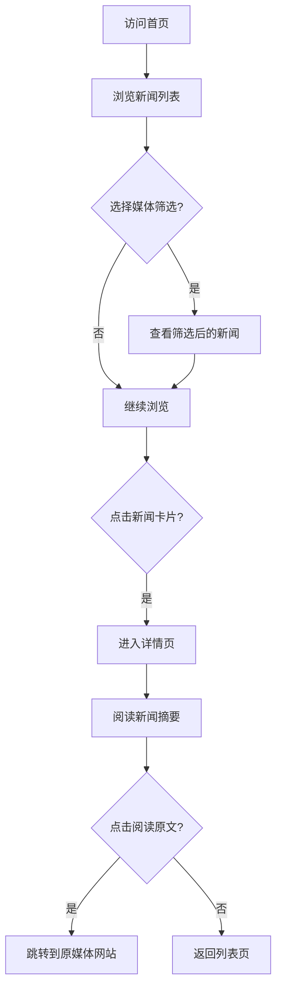

## 1. Product Overview
实时新闻聚合平台，展示主流媒体最新新闻内容，提供新闻摘要和原文跳转功能。
- 为用户提供一站式实时新闻浏览体验，聚合多家主流媒体内容，支持原文链接跳转
- 打造类似App Store iOS 18风格的简洁、现代、美观的用户界面

## 2. Core Features

### 2.1 User Roles
| Role | Registration Method | Core Permissions |
|------|---------------------|------------------|
| Normal User | No registration needed | Browse news list, view news details, jump to original news |

### 2.2 Feature Module
1. **新闻列表页**: 顶部导航、实时新闻列表、媒体筛选、加载更多
2. **新闻详情页**: 新闻标题、来源信息、发布时间、新闻摘要、原文链接

### 2.3 Page Details
| Page Name | Module Name | Feature description |
|-----------|-------------|---------------------|
| 新闻列表页 | 顶部导航 | 显示网站logo、标题，固定在页面顶部 |
| 新闻列表页 | 媒体筛选 | 支持按主流媒体筛选新闻 |
| 新闻列表页 | 新闻卡片列表 | 展示新闻标题、媒体来源、发布时间、缩略图，卡片式布局 |
| 新闻列表页 | 实时更新 | 显示新闻发布的相对时间，定期刷新 |
| 新闻详情页 | 新闻标题区 | 展示完整标题、媒体Logo、发布时间 |
| 新闻详情页 | 新闻摘要 | 显示新闻的详细摘要内容 |
| 新闻详情页 | 原文链接 | 提供"阅读原文"按钮，跳转到原媒体网站 |

## 3. Core Process
用户访问网站首页，浏览实时新闻列表，可通过筛选查看特定媒体的新闻。点击感兴趣的新闻卡片进入详情页，阅读摘要内容，如需查看完整内容可点击"阅读原文"跳转到原媒体网站。

## 4. User Interface Design
### 4.1 Design Style
- **Primary colors**: 白色背景 (#FFFFFF)，系统蓝 (#007AFF) 为主色调，浅灰 (#F5F5F7) 为辅助色
- **Button style**: 圆角矩形，轻微阴影，悬停时轻微放大，iOS风格按钮
- **Font and sizes**: 使用 SF Pro 或系统默认字体，标题 24-28px，正文 16px，辅助文字 14px
- **Layout style**: 卡片式布局，充足留白，网格排列，固定顶部导航
- **Icon style**: 使用线性简约图标，如lucide-react

### 4.2 Page Design Overview
| Page Name | Module Name | UI Elements |
|-----------|-------------|-------------|
| 新闻列表页 | 顶部导航 | 纯色背景，居中logo，简洁线条，轻微阴影 |
| 新闻列表页 | 新闻卡片 | 白色背景，圆角12px，轻微阴影，悬停时阴影加深，左对齐文字，右侧缩略图 |
| 新闻详情页 | 详情页面 | 宽屏阅读体验，适中的行高，清晰的信息层级 |
| 新闻详情页 | 原文按钮 | 系统蓝色，圆角按钮，带有箭头图标 |

### 4.3 Responsiveness
桌面端优先，自适应移动设备，在小屏幕上调整为单列布局，优化触摸体验。

### 4.4 Interaction Design
- 新闻卡片悬停效果：阴影加深，轻微上浮
- 页面过渡动画：平滑的页面切换效果
- 加载状态：骨架屏显示
- 按钮交互：点击反馈动画
